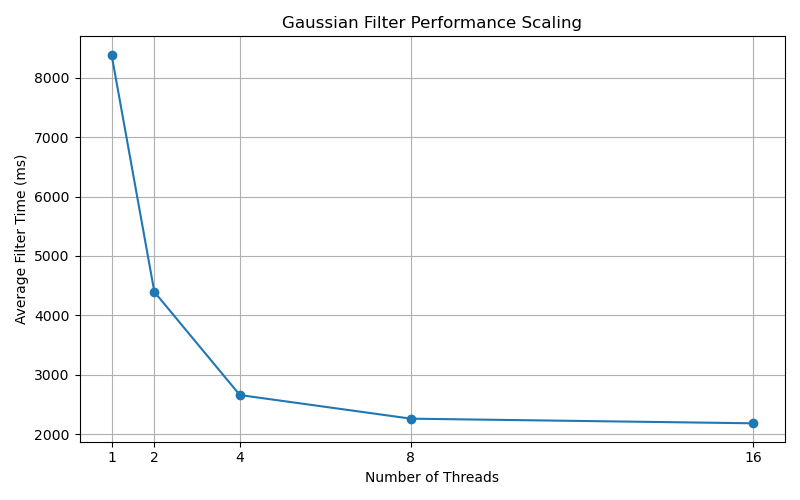

# Lab 1: Parallel Gaussian Filter Performance Report

## 1. Introduction
This report presents the parallelization of the Gaussian filter used in the BMP image processing Lab 1 solution. I implement a thread-safe, double-buffered convolution approach to leverage multi-core CPUs, and compare performance against the original single-threaded version.

## 2. Methodology

### 2.1 Code Changes
- Implemented a double-buffered approach: copied original pixels into a read-only buffer and wrote filtered results into a separate `newPixels` buffer to avoid write conflicts.
- Replaced fixed-strip threading with dynamic scheduling using an `std::atomic<int>` row counter, improving load balancing across threads.
- Added `#pragma GCC ivdep` in the inner convolution loop to hint the compiler for SIMD vectorization.
- Modified `main.cpp` to overlap rotation I/O with computation by launching `rotateAndSave` calls asynchronously using `std::async` and `<future>`.
- Instrumented the filtering call with `std::chrono` timers to measure per-thread performance.

### 2.2 Benchmark Setup
- **Hardware:** macOS Darwin 24.3.0, Apple M1, 8 cores.
- **Compiler & Flags:** `g++ -std=c++17 -O2 -Wall -Werror -Wpedantic -pthread`
- **Input Image:** `big_image.bmp` (5184×3456 pixels).
- **Thread Counts Tested:** 1, 2, 4, 8, 16.
- **Repeats:** 5 runs per thread count; averaged results.
- **Automation:** `bench.sh` script in project root automates runs and writes `bench_results/results.csv`.

## 3. Results

### 3.1 Average Filter Times
| Threads | Avg Time (ms) |
|--------:|--------------:|
|       1 |         8389 |
|       2 |         4395 |
|       4 |         2658 |
|       8 |         2260 |
|      16 |         2182 |

### 3.2 Performance Scaling



## 4. Discussion
- **Speedup:** Roughly 2× from 1→2 threads, ~3.1× at 4 threads, ~3.8× at 8 threads.
- **Diminishing Returns:** Overheads and memory contention limit scalability beyond 8 threads; slight slowdown at 16 threads likely due to hyperthreading overhead.
- **Amdahl's Law:** The filter portion is highly parallelizable, but I/O and thread startup contribute to serial costs.

## 5. Conclusion
The parallel Gaussian filter achieves substantial speedup on a large image, peaking at ~3.8× with 8 threads.

## Appendices

### Build & Run Commands
```bash
mkdir -p build && cd build
cmake ..
make -j8
```

Benchmark invocation:
```bash
./bench.sh
python3 plot_results.py
```

### Source Files Modified
- `src/bitmap.cpp`: reworked `applyGaussianFilter` to use double-buffering and lambda-based threading.
- `src/main.cpp`: added timing instrumentation using `<chrono>`.
- `bench.sh`: automated benchmarking.
- `plot_results.py`: generated performance plot.
